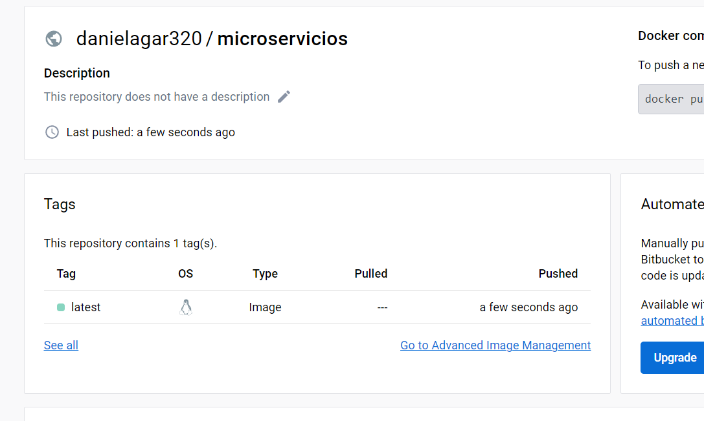

# LABORATORIO DE MICROSERVICIOS AREP

En este laboratorio se diseño un API y un monolito Quarkus que permite a los usuarios hacer posts e ir registrandolos en un stream único de posts (a la Twitter) y se desplego en S3.

### Autor

* **Daniela García Romero**: [danielagar320](https://github.com/danielagar320)


### Prerequisitos
* Maven: Herramienta para la gestión y construcción de proyectos.
* Java: Lenguaje de programación.
* Git: Sistema de control de versiones distribuido.
* AWS: Servicio de nube.
* Quarkus: Framework de Java.
* Docker: plataforma de software para permite crear, probar e implementar aplicaciones rápidamente.

## Solución

### Uso de la aplicación

Para poder correr el programa se deben seguir los siguientes pasos:
* Clonar el respositorio con el comando

```
git clone https://github.com/danielagar320/MicroserviciosAREP.git

```

* Correr el proyecto con el siguiente comando:

```
quarkus dev

```

* En el browser usar la siguiente url:

```
http://localhost:8080/login/login.html

```

* Para ingresar se ben ingresar el usuario y la clave que aparece a continuación:

```
usuario: daniela
clave: 123

```

### Despliegue en AWS

* Se creo un repositorio llamado microservicios en docker hub.


* Se creo un bucket s3.


* Se agrego la carpeta que contiene el front.


* Con el url se probo que estuviera funcionando.


* Se creo una instancia de EC2.


* Se agregaron los puertos que se usarian los cuales son 4565, 4566 y 4567.


* Se instalo docker en la instancia de EC2. 


* Se creó la imagen de docker y se verifico que se pudiera correr.


* Se realizo un push para subir la imagen al respositorio de docker hub.




* Se creo una instamcia de docker en la instancia de EC2 para cada puerto creado anteriormente.


* Verificación de la creación.


* Se probo el funcionamiento.


**El funcionamiento completo del proyecto se encuentra en el video**